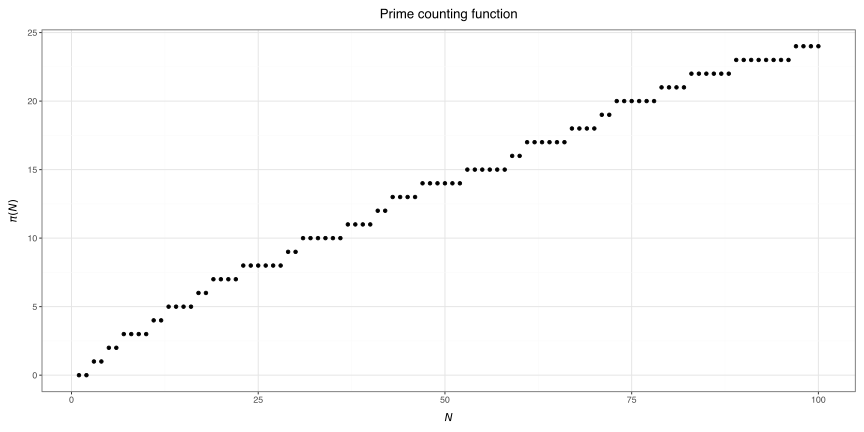

# Basic Math

This module shows an example
of a Python library structure
using [`nanobind`](https://nanobind.readthedocs.io/en/latest/).

## Installation

This library is not on PyPI,
so it must be compiled from source.
1. Clone this repository.
2. Install with `pip install .`.

## Functionality

This module implements a single function: `check_prime`,
which checks if an integer is prime or not.
The underlying check is the
[Miller-Rabin primality test](https://en.wikipedia.org/wiki/Miller–Rabin_primality_test),
implemented in C++,
which is then binded to Python using nanobind.

```{python3}
import basicmath as bm

print(bm.check_prime(87))  # True
```



## Project Structure

- The C++ implementations are stored in the `basicmath-src` directory,
which compiles an internal `_basicmath` module to be called by Python.
- The Python library implementation which makes calls to the bindings
is stored in the `basicmath-py` directory.

```
basicmath/
|--CMakeLists.txt
|--pyproject.toml
|--README.md
|--basicmath-py/
   |--basicmath/    # Python library calling bindings
   |--tests/        # unit tests
|--basicmath-src/
   |--bindings.cpp  # binding file
   |--cpp/          # C++ implementations
```

Note that the structure of this library diverges from the
[Python Packaging User Guide](https://packaging.python.org/en/latest/tutorials/packaging-projects/).
They recommend having all source code in a single `src` directory:
```
basicmath/
|--CMakeLists.txt
|--pyproject.toml
|--README.md
|--src/
   |--basicmath/    # Python library calling bindings
   |--bindings.cpp  # binding file
   |--cpp/          # C++ implementations
   |--tests/        # unit tests
```

Ultimately, there is no correct way.
My choice of structure is somewhat based on open source projects
that I use frequently.
Some examples:
- [`polars`](https://github.com/pola-rs/polars):
The Python library is in the `py-polars` directory,
while the Rust source is in the `crates` directory.
- [`pytorch`](https://github.com/pytorch/pytorch/tree/main):
The Python library is in the `torch` directory,
while the C++ source is in the `aten` directory.

## Pybind11

While this project is based on the newer `nanobind`,
there is also the more established [`pybind11`](https://pybind11.readthedocs.io/en/stable/).

Examples of corresponding binding and CMake files for `pybind11`
can be found in the `_pybind11_files` directory.

Both `nanobind` and `pybind11` are authored by
[Wenzel Jakob](https://rgl.epfl.ch/people/wjakob).
He gives a write-up of his motivations behind `nanobind`
[here](https://nanobind.readthedocs.io/en/latest/why.html),
and also recommends that current `pybind11` users migrate over to `nanobind`.
