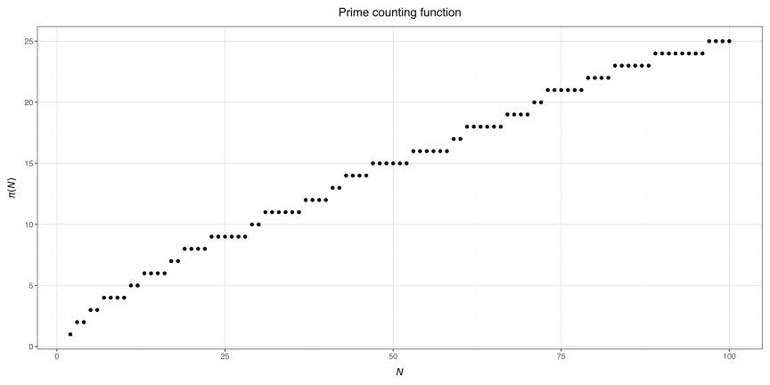

# Basic Math

This module shows an example
of a Python library structure
using [nanobind](https://nanobind.readthedocs.io/en/latest/).

## Installation

This library is not on PyPI,
so it must be compiled from source.
1. Clone this repository.
2. Install with `pip install .`.

## Functionality

This module implements a single function: `check_prime`,
which checks if an integer is prime or not.
The underlying check is the
[Miller-Rabin primality test](https://en.wikipedia.org/wiki/Miller–Rabin_primality_test),
implemented in C++,
which is then binded to Python using nanobind.

```{python3}
import basicmath as bm

print(bm.check_prime(87))  # True
```


